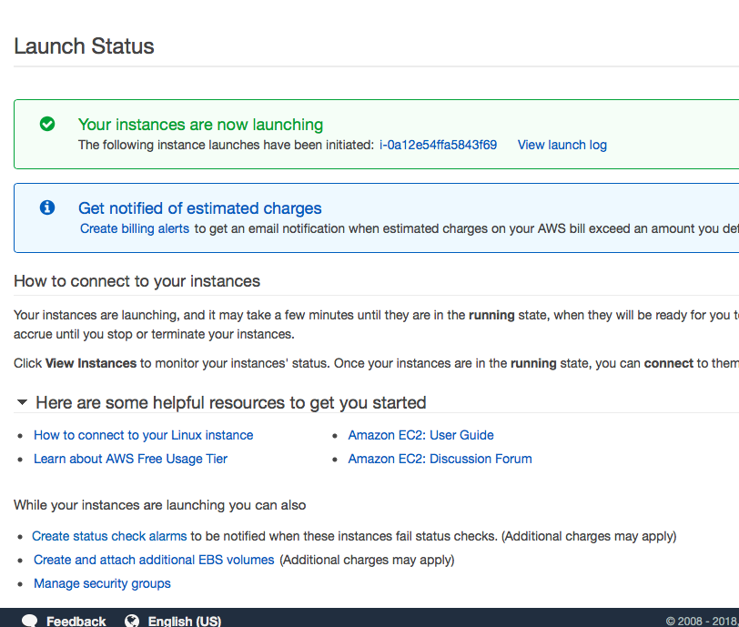

# DDBJ Search System deploy manual

Amazon Web Service を利用して DDBJ Search をデプロイします。(想定作業時間: 最長1時間程度)

# システム概要

システムは以下の2つのコンポーネントに分かれています:

1. APIサーバ
  - メタデータの取得と更新
  - 全文検索用のインデックス作成
  - 全文検索を含むAPIの提供
2. View
  - データ検索・閲覧用GUIの提供


# デプロイのおおまかな手順

システムの起動と運用に必要な項目は以下の通りです:

1. APIサーバを Amazon Machine Image (AMI) から起動する
  1. 指定された AMI からインスタンス (サーバ) を起動する
  2. Elastic IP (EIP) で Global IP を永続化する
  3. API が正常に起動しているかテストする
2. View のコード一式を S3 に配置する
  1. View のコードを GitHub からローカルに git clone する
  2. config ファイルを修正する
  3. Amazon S3 のブラウザ管理画面からファイル一式をアップロードする

# デプロイの詳細な手順

## 1. APIサーバを Amazon Machine Image (AMI) から起動する

DDBJ Search API サーバ (開発コード: PUNK API) は AMI として共有されます。まずこれを EC2 で起動し、Elastic IP で Global IP を設定したのちに、正常起動しているかテストをします。

### 1-1. 指定された AMI からインスタンス (サーバ) を起動する

Amazon Web Service にはたくさんのサービスがありますが、最も分かりやすいのがこの Elastic Compute Cloud (EC2) です。いわゆる「クラウドにサーバを建てる」と言ったときにイメージするものです。クラウドサーバの1つの単位を一般的にインスタンスと呼びます。今回は単純な1台のサーバを起動するため、基本となるマシンイメージの選択、インスタンスタイプ (サーバのスペック)、ネットワークなどのオプション、アタッチするディスク、開放するポートを順に設定します。

#### 1-1-1.

- https://console.aws.amazon.com にアクセスしてログイン
- 画面右上のリージョン選択タブから Asia Pacific (Tokyo) を選択


#### 1-1-2.

- サービス選択画面のリストから Compute > EC2 を選択


#### 1-1-3.

EC2管理画面の中央の Launch Instance をクリック


#### 1-1-4. "Step 1: Choose AMI" 画面

- AMI 選択画面の左のパネルから My AMIs を選択, "Shared with me" にチェックを入れる
- キーワード検索ボックスに "PUNK" と入力して絞り込み、最新のAMI (PUNK_API_2018_5_10) の "Select" をクリックする


#### 1-1-5. "Step 2: Choose Instance Type" 画面

- "t2.medium" を選択
  - 本番環境ではロードバランサ、オートスケールなどの設定もしたほうがよいが、今回はテストなので t2.medium で
  - "Next: Configure Instance Details" をクリック


#### 1-1-6. "Step 3: Configure Instance Details" 画面

- "Network" の右の "Create new VPC" をクリック


#### 1-1-7. 別タブ "VPC Dashboard" 画面

- "Create VPC" をクリック
  - "Name tag" に適当な名前 (ここでは ddbj-search) を入力
  - IPv4 CIDR block に `10.0.0.0/16` と入力
  - "No IPv6 CIDR Block" にチェック
  - "Tenancy" は "Default" にチェック
  - 右下の "Yes, Create" をクリック


---


#### 1-1-8. "Step 3: Configure Instance Details" 画面に戻る

- "Network" で作成した VPC "ddbj-search" を選択
- "Next: Add Storage" をクリック


#### 1-1-9. "Step 4: Add Storage" 画面

- ボリュームサイズはデフォルト (350GB) のまま "Next: Add Tags" をクリック


#### 1-1-10. "Step 5: Add Tags" 画面

- 画面中央の "Click to Add a Name tag" をクリック
- Name tag の Value に適当な名前を付ける (ここでは ddbj-search-api)
- "Next: Configure Security Group" をクリック


#### 1-1-11. "Step 6: Configure Security Group" 画面

- "Assign a security group" で "Create a new security group" を選択
- "Security group name", "Description" を適当に入力する
- デフォルトの Type: SSH はそのままに "Add Rule" をクリックして "HTTP" を追加
- それ以外はデフォルトのまま "Review and Launch" をクリック


#### 1-1-12. "Step 7: Review Instance Launch" 画面

- Your security group is open to the world とアラートが出るが無視
- Instance Type が t2.medium であることを確認
- その他は後でも変更できるので確認したら "Launch" をクリック
- Select an existing key pair or create a new key pair (秘密鍵作成) ダイアログ
  - "Create a new key pair" をプルダウンから選択
  - Key pair name に適当な名前を入力 (ここでは ddbj-search)
  - "Download Key Pair" をクリック
    - `ddbj-search.pem` というファイルがダウンロードされる (ダウンロード時に.txt拡張子が付く場合もある)
    - 適当な場所に移して `chmod 600 ddbj-search.pem` しておく
  - "Launch Instances" をクリックする


#### 1-1-13. "Launch Status" 画面

- "Your instances are now launching" のダイアログ
- "The following instance launches have been initiated" の後に表示されるインスタンスID (i-xxxxxx) をクリック



#### 1-1-14. "EC2 Dashboard" 画面

- 起動中のインスタンスが選択された状態の Dashboard が表示される
- Status Checks が Initializing になっているのでしばらく待つ
- 2/2 passed となったら完了


---


### 1-2. Elastic IP (EIP) で Global IP を永続化する

起動した EC2 インスタンスには Global IP が振られており、インスタンスの詳細表示画面で確認することができます。このIPを使うと立ち上げたインスタンスにアクセスができますが、この Global IP はインスタンスを起動/停止/再起動などした場合に変更されてしまいます。GUIから叩きに行くAPIの Global IP が度々変わると困るので、Elastic IP という永続するIPを発行し、起動したインスタンスに適用します。

#### 1-2-1. EC2 Dashboard 画面

- 左サイドメニューの Network & Security 下、 "Elastic IPs" をクリック


#### 1-2-2.

- "Allocate new address" をクリック


#### 1-2-3.

- Scope で "VPC" を選択
- "Allocate" をクリック


#### 1-2-4.

- New address request succeeded と表示されたら allocate された EIP のアドレスをクリック


#### 1-2-5.

- EIP が選択された状態で "Actions" をクリック、プルダウンから "Associate address" をクリック


---


#### 1-2-6.

- Resource type　に "Instance" を選択
- Instance のボックスに "ddbj" と入力すると先ほど建てたインスタンスが表示されるのでこれをクリックして選択
- "Associate" をクリック


#### 1-2-7.

- Associate address request succeeded と表示されたら成功、Close をクリックして戻る


なお、EIPは付け替え (deassociate/associate) ができるので、新しいバージョンの AMI ができたら、そちらを建てておいて、EIPを新しいものに付け替えることで、IPはそのままでサーバを落とすことなく新しいバージョンにスイッチする、というテクニックが可能です。これをブルー・グリーン・デプロイメントと呼びます。

### 1-3. API が正常に起動しているかテストする

以上の操作により、Amazon Web Service 上で API サーバが起動し、(開放しない限り) 永続する EIP を付加して、サーバがインターネット上で見えるようになりました。サーバにアクセスして、正常に起動しているか確認をします。

#### 1-3-1. APIサーバにアクセスする

- EC2 Dashboard の左サイドメニュー "Instances" をクリック
- ddbj-search を選択
- 下パネルに表示される Elastic IP をブラウザにコピペしてアクセス
- `# DBCLS OMICS SEARCH API...` とテキストが表示されたらAPIは起動しています
  - ここに表示されるメッセージは暫定のもので修正される予定です

#### 1-3-2. APIを叩いてみる

いくつかの API を叩いてみます。ブラウザでアクセスしてもいいですし、ローカルのターミナルからcurlで叩いてもいいです。ここではcurlで叩く風にやります。

```
$ curl http://13.231.66.138/api
{"sra": {"sample": {"last_update": "2018-05-03", "numFound": 13518161}, "study": {"last_update": "2018-05-03", "numFound": 13518161}, "analysis": {"last_update": "2018-05-03", "numFound": 13518161}, "numFound": 13518161, "run": {"last_update": "2018-05-03", "numFound": 13518161}, "last_update": "2018-05-03", "experiment": {"last_update": "2018-05-03", "numFound": 13518161}}, "bioproject": {"last_update": "2018-05-09", "numFound": 295450}, "biosample": {"last_update": "2018-05-09", "numFound": 8266887}}
```

```
$ curl http://13.231.66.138/api/biosample
{"numFound": 8266887, "last_update": "2018-05-03"}
```

ちゃんと動いています。

## 2. View のコード一式を S3 に配置する

ユーザにブラウザから使ってもらう GUI (View) は、EC2 ではなく AWS Simple Storage Service (S3) を使います。S3 は EC2 のような Linux サーバではなく、dropbox のようなクラウドファイルストレージです。S3はファイルストレージとして EC2 にアタッチして使うこともできますが、そのまま静的ファイルをウェブに公開するためのホスティングサービスとしても使えます。そのため、HTML/CSS/JS だけで構築された static なウェブサイトは S3 にファイルを置いてウェブに公開することでウェブサイトとして運用することができます。

EC2と違う利点としては、サーバのメンテをしなくていいこと、データ保存にかかる料金が EC2 (正確にはEC2にアタッチしたブロックストレージであるEBS) よりも安いことが挙げられます。

### 2-1. View のコードを GitHub からローカルに git clone する

View のコードを GitHub repo から取ってきます。

```
$ cd /path/to/repos # ローカルでレポジトリを管理する適当なディレクトリへ
$ git clone https://github.com/dogrunjp/DDBJSearch/
```

無事に clone できたら完了です。

### 2-2. config ファイルを修正する

EC2 で建てた API を差すように config を修正します。その際に、元のコードと修正した production 用のコードを区別するためにブランチを切ります。

```
$ cd DDBJSearch
$ git checkout -b production
$ git branch -v
  master
* production
```

適当なエディタで `js/config.js` を編集します。

```
$ <your favorite editor> js/config.js
```

```
var conf = {
    //api_search_base_url : "http://localhost:8080/api/search?",
    //api_details_base_url : "http://localhost:8080/api/details?db=",
     api_search_base_url: "http://13.231.66.138/api/search?",
     api_details_base_url : "http://13.231.66.138/api/details?db=",
     api_update_url: "http://13.231.66.138/api",
     api_chart_url: "http://13.231.66.138/api"
}
```

このテキストの `13.231.66.138` を、先ほど起動したインスタンスに assign した EIP を入力して保存します。

### 2-3. Amazon S3 のブラウザ管理画面からファイル一式をアップロードする

編集が完了した `DDBJSearch` のファイル一式を AWS S3 にアップロードします。

#### 2-3-1. AWS console 画面

- 画面左上、AWSのロゴをクリックしてサービス選択画面に戻る
- Storage > S3 をクリック (もしくは S3 で検索してクリック)


#### 2-3-2. Amazon S3 画面

- Create bucket をクリック


#### 2-3-3. Name and region 画面

- Bucket name に ホスティング予定の URL を入力 (ここでは sra.dbcls.jp)
  - これが GUI としてアクセスするドメインと必ず同じでなくてはいけないことに注意
- Region が Tokyo になっていることを確認
- Next をクリック


#### 2-3-4. Set properties 画面

- Versioning などのパネルが出てくるが無視
  - ログなど取りたいがとりあえず後回し
- Next をクリック


#### 2-3-5. Set permissions 画面

- "Manage public permissions" で "Grant public read access to this bucket" を選択
- "Read bucket permissions" を選択
- アラートを無視して Next をクリックする


#### 2-3-6.  Review 画面

- 設定を確認して Create をクリック


#### 2-3-7.

- 作成した Bucket をクリック
  - Bucket のプロパティが表示されるので Properties をクリック


#### 2-3-8. Bucket Properties 画面

- "Static website hosting" のパネルをクリック


#### 2-3-9.  Static website hosting 設定画面

- "Use this bucket to host a website" にチェックを入れる
- Index document, Error document にそれぞれ `index.html` と入力
- Save をクリック


#### 2-3-10.

- Bucket hosting にチェックが入っていることを確認
- 再度 Bucket hosting のパネルをクリックし、 `Endpoint` として表示されている URL をクリック
  - 先ほど `index.html` を表示するように設定したが、まだ何も入れていないので `404` が返る
  - S3の画面に戻る


#### 2-3-11.

- "Permissions" のパネルをクリック
  - "Bucket Policy" をクリック
    - テキストボックスに以下のテキストを入力
    - `sra.dbcls.jp` の部分をホストするドメインに変更
    - "Save" をクリック

```
{
    "Version": "2008-10-17",
    "Statement": [
        {
            "Sid": "PublicReadForGetBucketObjects",
            "Effect": "Allow",
            "Principal": {
                "AWS": "*"
            },
            "Action": "s3:GetObject",
            "Resource": "arn:aws:s3:::sra.dbcls.jp/*"
        }
    ]
}
```

#### 2-3-12.

- "Overview" のパネルをクリック
  - "Upload" をクリック
  - `git clone` した `DDBJSearch` ディレクトリの **中身** を全てドラッグアンドドロップする
  - "Upload" をクリック
  - ファイルがアップロードされるのを待つ


#### 2-3-13.

- 先ほど `404` が返された Endpoint のURLに再度アクセス
- :tada:


# おつかれさまでした！
